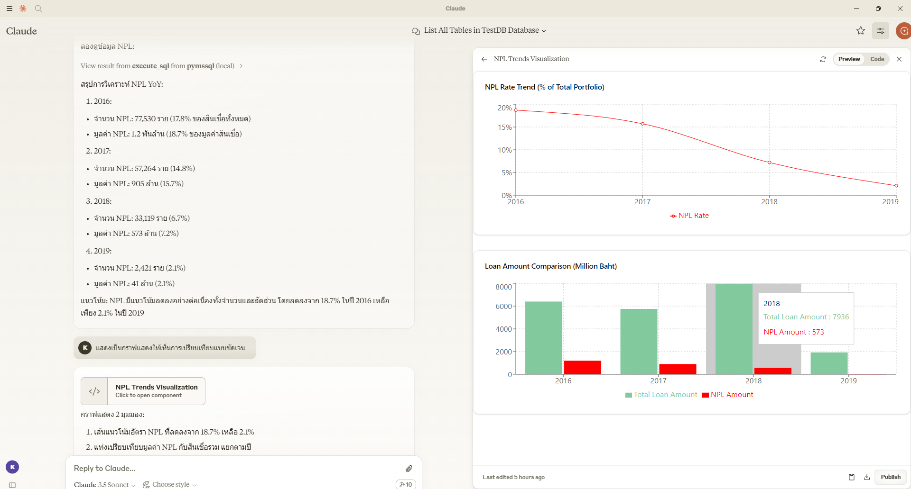

[](https://mseep.ai/app/amornpan-py-mcp-mssql)

# Python MSSQL MCP Server

[](https://github.com/amornpan/py-mcp-mssql)
[](https://www.python.org)
[](https://github.com/modelcontextprotocol)
[](https://fastapi.tiangolo.com)
[](LICENSE)

A Model Context Protocol server implementation in Python that provides access to Microsoft SQL Server databases. This server enables Language Models to inspect table schemas and execute SQL queries through a standardized interface.

## Features

### Core Functionality
* Asynchronous operation using Python's `asyncio`
* Environment-based configuration using `python-dotenv`
* Comprehensive logging system
* Connection pooling and management via pyodbc
* Error handling and recovery
* FastAPI integration for API endpoints
* Pydantic models for data validation
* MSSQL connection handling with ODBC Driver

## Prerequisites

* Python 3.x
* Required Python packages:
  * pyodbc
  * pydantic
  * python-dotenv
  * mcp-server
* ODBC Driver 17 for SQL Server

## Installation

```bash
git clone https://github.com/amornpan/py-mcp-mssql.git
cd py-mcp-mssql
pip install -r requirements.txt
```

## Screenshots



The screenshot above demonstrates the server being used with Claude to analyze and visualize SQL data.

## Project Structure

```
PY-MCP-MSSQL/
├── src/
│   └── mssql/
│       ├── __init__.py
│       └── server.py
├── tests/
│   ├── __init__.py
│   ├── test_mssql.py
│   └── test_packages.py
├── .env
├── .env.example
├── .gitignore
├── README.md
└── requirements.txt
```

### Directory Structure Explanation
* `src/mssql/` - Main source code directory
  * `__init__.py` - Package initialization
  * `server.py` - Main server implementation
* `tests/` - Test files directory
  * `__init__.py` - Test package initialization
  * `test_mssql.py` - MSSQL functionality tests
  * `test_packages.py` - Package dependency tests
* `.env` - Environment configuration file (not in git)
* `.env.example` - Example environment configuration
* `.gitignore` - Git ignore rules
* `README.md` - Project documentation
* `requirements.txt` - Project dependencies

## Configuration

Create a `.env` file in the project root:

```env
MSSQL_SERVER=your_server
MSSQL_DATABASE=your_database
MSSQL_USER=your_username
MSSQL_PASSWORD=your_password
MSSQL_DRIVER={ODBC Driver 17 for SQL Server}
```

## API Implementation Details

### Resource Listing
```python
@app.list_resources()
async def list_resources() -> list[Resource]
```
* Lists all available tables in the database
* Returns table names with URIs in the format `mssql://<table_name>/data`
* Includes table descriptions and MIME types

### Resource Reading
```python
@app.read_resource()
async def read_resource(uri: AnyUrl) -> str
```
* Reads data from specified table
* Accepts URIs in the format `mssql://<table_name>/data`
* Returns first 100 rows in CSV format
* Includes column headers

### SQL Execution
```python
@app.call_tool()
async def call_tool(name: str, arguments: dict) -> list[TextContent]
```
* Executes SQL queries
* Supports both SELECT and modification queries
* Returns results in CSV format for SELECT queries
* Returns affected row count for modification queries

## Usage with Claude Desktop

Add to your Claude Desktop configuration:

On MacOS: `~/Library/Application Support/Claude/claude_desktop_config.json`
On Windows: `%APPDATA%/Claude/claude_desktop_config.json`

```json
{
  "mcpServers": {
    "mssql": {
      "command": "python",
      "args": [
        "server.py"
      ],
      "env": {
        "MSSQL_SERVER": "your_server",
        "MSSQL_DATABASE": "your_database",
        "MSSQL_USER": "your_username",
        "MSSQL_PASSWORD": "your_password",
        "MSSQL_DRIVER": "{ODBC Driver 17 for SQL Server}"
      }
    }
  }
}
```

## Error Handling

The server implements comprehensive error handling for:
* Database connection failures
* Invalid SQL queries
* Resource access errors
* URI validation
* Tool execution errors

All errors are logged and returned with appropriate error messages.

## Security Features

* Environment variable based configuration
* Connection string security
* Result set size limits
* Input validation through Pydantic
* Proper SQL query handling

## Contact Information

### Amornpan Phornchaicharoen

[](mailto:amornpan@gmail.com)
[](https://www.linkedin.com/in/amornpan/)
[](https://huggingface.co/amornpan)
[](https://github.com/amornpan)

Feel free to reach out to me if you have any questions about this project or would like to collaborate!

---
*Made with ❤️ by Amornpan Phornchaicharoen*

## License

This project is licensed under the MIT License - see the [LICENSE](LICENSE) file for details.

## Author

Amornpan Phornchaicharoen

## Contributing

1. Fork the repository
2. Create your feature branch (`git checkout -b feature/amazing-feature`)
3. Commit your changes (`git commit -m 'Add some amazing feature'`)
4. Push to the branch (`git push origin feature/amazing-feature`)
5. Open a Pull Request

## Requirements

Create a `requirements.txt` file with:

```
fastapi>=0.104.1
pydantic>=2.10.6
uvicorn>=0.34.0 
python-dotenv>=1.0.1
pyodbc>=4.0.35
anyio>=4.5.0
mcp==1.2.0
```

These versions have been tested and verified to work together. The key components are:
* `fastapi` and `uvicorn` for the API server
* `pydantic` for data validation
* `pyodbc` for SQL Server connectivity
* `mcp` for Model Context Protocol implementation
* `python-dotenv` for environment configuration
* `anyio` for asynchronous I/O support

## Acknowledgments

* Microsoft SQL Server team for ODBC drivers
* Python pyodbc maintainers
* Model Context Protocol community
* Contributors to the python-dotenv project